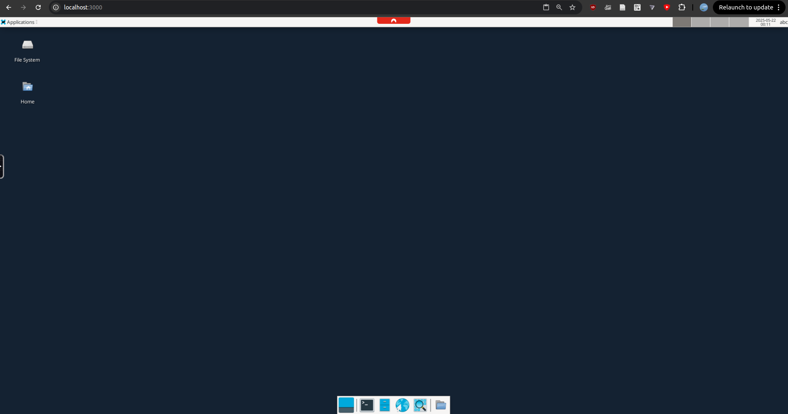

<!-- omit in toc -->
## WebTop

`webtop` ("web desktop") is a simple solution to run a Linux operating system and desktop environment (specifically: Debian 12 with the XFCE user interface) within your existing operating system, and interact with the Linux desktop in your browser (no VirtualBox / VMWare / VNC client necessary!). Your files are synchronized between the Linux instance and your current operating system via a shared `data/` folder.

<!-- omit in toc -->
## Table of Contents 
- [How to use `webtop`](#how-to-use-webtop)
- [Updating `webtop`](#updating-webtop)
  - [WARNING: Important Notes!](#warning-important-notes)
- [Advanced Usage](#advanced-usage)
- [Design and Rationale](#design-and-rationale)
  - [Error: failed to bind host port..](#error-failed-to-bind-host-port)
  - [Error: "Cannot connect to the Docker daemon"](#error-cannot-connect-to-the-docker-daemon)
  - [Audio does not work](#audio-does-not-work)
- [Testing](#testing)

## How to use `webtop`

This section assumes you have little to no experience with a terminal or `git`. 

1. Download `webtop` by clicking on [this link](https://github.com/learn-compsci/webtop/archive/refs/heads/main.zip). It should download a `.zip` file. Unzip into a folder of your choice (but remember where it is!)

2. Install Docker for your platform. Docker is the technology that what ultimately runs `webtop`. 
      - Windows: https://docs.docker.com/desktop/setup/install/windows-install/
      - Mac: https://docs.docker.com/desktop/setup/install/mac-install/  
      - Linux-based: https://docs.docker.com/engine/install/

3. Now, start `webtop` via the scripts we provide.
      - Windows: double click on `windows-start.bat`. You may have to click "More Info" on the popup that appears to force Windows to run this script. The script should cause a terminal window to pop up and stay open.

      - Mac / Linux
        - Open a Terminal window in the folder that you unzipped. 
          - Mac: The easiest way is to follow these instructions while having the folder opened in Finder: https://apple.stackexchange.com/a/438999
          - Linux: you probably know what to do, otherwise typically right clicking within the folder will show you a "Open in Terminal" option or similar
        - Type the command `docker compose up` and press ENTER.
  

4. Open your browser (e.g., Chrome/Firefox/Safari) and type `localhost:3000` into your address bar and hit ENTER. You should be able to see what looks like a user interface (desktop) that looks something like this.

5. The files you create on `webtop` are mostly automatically shared / synced to the `data/` folder that should be created. Try adding a file to `data/Desktop/` and see what happens in the web interface!

6. Press the key combination "Control-C" (Control and C keys together) (the key combination might depend on your operating system) to stop Webtop from the terminal. Alternatively, you can just close the terminal window.

## Updating `webtop`

- If we release a new version of `webtop` during the semester (likely), please do the following:
  - Windows: double click on `windows-update.bat`
  - Mac and Linux:
    - Open a terminal instance in the folder (or navigate to the folder with `cd`, etc) with the `docker-compose.yml` file
    - Run the command `docker compose pull`
    - Then run the command `docker compose build --no-cache`
    - After these steps, you follow the steps above to run WebTop as per usual

### WARNING: Important Notes!

- **Do not install applications system-wide**. The `webtop` environment only guarantees that files in your home directory (`~/` i.e., `/config`) are retained on each reboot. If you install applications system-wide, they may not be available the next time you start `webtop`, especially if you update the environment.

  - You can install applications locally (within `~/`), or use [proot-apps](https://github.com/linuxserver/proot-apps) to do this, but we try to install everything that you need from the start.

## Advanced Usage

This section is appropriate if you are familiar with the terminal and `git`.

1. Clone the repository to your local machine using `git clone git@github.com:learn-compsci/webtop.git`.

2. Install Docker for your operating system.

3. Run `docker compose up` in the cloned folder.

4. Open your browser and go to the site `localhost:3000`. 

5. To update the environment to the latest we provide, use `docker compose pull`.

## Design and Rationale

Getting non-Linux users to run a Linux operating system isn't always easy. Installing multiple operating systems on the same machine is an involved process. Virtual machines (VMs) are sometimes slow, and it's hard to run them with equal features across both Windows (x86 machines) and Mac (ARM machines) (we've tried!). 

`webtop` is heavily based on [docker-webtop](https://github.com/linuxserver/docker-webtop), which is itself based on [KasmVNC](https://github.com/linuxserver/docker-baseimage-kasmvnc). KasmVNC is the primary technology that allows us to interact with the Linux desktop in a browser over [VNC](https://en.wikipedia.org/wiki/VNC). Our contributions are limited to modifications of the base images to make them appropriate for our use case.

### Error: failed to bind host port..

If you see an error like "failed to bind host port for 0.0.0.0:3000", that means you might already have an application running on that port.

**Solution:**  
- Go to the `docker-compose.yml` file in this folder. 
- Under `ports`, change the `3000:3000` to e.g., `3005:3000`, where `3005` is the new port number on your existing operating system. 
- Now you can use `localhost:3005` to access WebTop.

---

### Error: "Cannot connect to the Docker daemon"

This usually means Docker is not running on your system.

**Solution:**  
- **Windows/Mac:** Open Docker Desktop and ensure it is running. You might have to restart your computer.
- **Linux:** Start Docker with `sudo systemctl start docker` or `sudo service docker start`.

---

### Audio does not work

You have to manually enable audio in the browser tab that's running WebTop (each time). This is intentional.

**Solution:**  
- Click the tiny arrow in the middle left of the screen (it looks like a play button). This opens a bar at the top middle of the screen. 
- Click the speaker icon to enable audio.
---

## Testing

- Check that audio works (e.g., go to Firefox (click the browser icon in the bottom dock), go to YouTube, click on any video). You may have to click or mouse over the icon like thing at the middle left of the screen, which opens a bar at the top middle of the screen, and click the audio icon.
- Check that the display size and scaling is OK
- Check that resizing the screen works (if you drag the edges of the VM window, the VM should resize)
- Check that there's little to no lag in inputs to say, the terminal, or a text editor.
