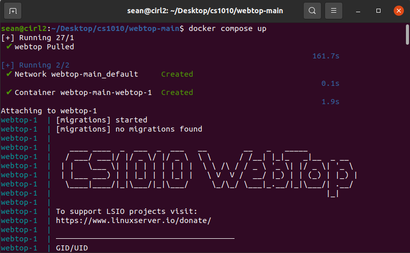
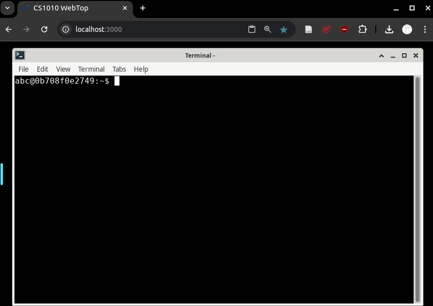

# Webtop Installation on Linux
This guide is designed to help you install and use `webtop` on Linux. We include step-by-step instructions to ensure a smooth setup process. 

**Note**: since Linux distributions can vary significantly, this guide assumes you have some familiarity with the terminal and basic Linux commands. It is very unlikely that you are new to Linux, but if you are, we recommend checking out some beginner-friendly resources on using the terminal and package management in your specific Linux distribution.

**Note2**: This guide is written for Ubuntu-based distributions, but the steps should be similar for other distributions. If you are using a different distribution, you may need to adjust the commands accordingly.

## Prerequisites
- **Linux Distribution**: A relatively modern Linux distribution 
- **Internet Connection**: A stable internet connection is required for downloading Docker and Git.
- **Administrator Access**: You may need administrator privileges to install software.

## Step 1: Installing Docker Desktop
Docker is essential for running `webtop`. Follow these steps to install Docker Desktop on Windows:

1. **Install Docker**: Install docker for your Linux distribution. You can find installation instructions for your specific distribution on the [Docker documentation](https://docs.docker.com/engine/install/). 

2. **Start Docker**: Start the Docker service if it is not already running. You can do this by running the following command in your terminal:
    ```bash
    sudo systemctl start docker
    ```
3. **Verify Docker Installation**: After installation, verify that Docker is installed correctly by running the following command in your terminal:
    ```bash
    docker --version
    ```
   You should see the version of Docker installed on your system.


### Congratulations🎉! You have successfully installed Docker Desktop on your Linux machine.

## Step 2: Installing and Running `webtop`
We host `webtop` on GitHub, and you can easily clone the repository to your local machine. Normally, you would use Git to clone the repository, but since you are new to Git, we will provide an alternative __(easier)__ method to download `webtop` directly as a ZIP file. 

1. **Downloading Webtop**: Download `webtop` by clicking on [this link](https://github.com/learn-compsci/webtop/archive/refs/heads/main.zip). It should download a `.zip` file. Unzip into a folder of your choice (but remember where it is!)

2. **Start Docker Desktop**: Start the Docker Daemon/Service  if it is not already running. 

3. **Start the Webtop Container**: Navigate to the folder where you installed `webtop` and run the following command:
    ```bash
    docker compose up
    ```

    This command will start the `webtop` container using Docker Compose. You should see output indicating that the container is starting up.
    </br>

4. **Accessing Webtop**: Once the container is running, open your web browser (e.g., Chrome, Firefox, Edge) and go to `http://localhost:3000`. You should see the `webtop` desktop interface.
    </br>

5. **Stopping Webtop**: To stop `webtop`, you can either:
    - Hit `Control-C` in the terminal where you started `webtop`. This will stop the Docker container and return you to the command prompt.
    - Close the terminal window where `webtop` is running. This will also stop the Docker container.

### Congratulations! You have successfully installed and run `webtop` on your machine. :shipit: :shipit: :shipit:
You can now use the `webtop` desktop environment in your web browser. However, before you dive in to exploring `webtop`, please read the rest of this guide to understand some [important usage notes](#critical-usage-notes) and how to [update](#updating-webtop) `webtop`. Furthermore, if you encounter any issues, we have a [troubleshooting section](#troubleshooting-common-issues) at the end of this guide.

# 🆕📦Updating Webtop🆕📦
We may occasionally release updates to `webtop`. The following steps will guide you through updating `webtop` on your system:

1. **Running the Update Command**: Follow instructions in [Step 2](#step-2-installing-and-running-webtop) to open a terminal in the `webtop` folder. 

2. **Pulling the Latest Changes**: In the terminal, run the following command to pull the latest changes from the `webtop` repository:
    ```bash
    docker compose pull
    ```
3. **Rebuilding the Container**: After pulling the latest changes, rebuild the `webtop` container by running:
    ```bash
    docker compose build --no-cache
    ```
4. **Start Webtop Again**: After the update is complete, you can start `webtop` again as usual.

# 🚨Critical Usage Notes🚨
Before using `webtop`, please read the following important notes regarding the `webtop` environment:

- **Data Sharing** The files you create on `webtop` are mostly automatically shared/synced to the `data/` folder that should be created.

- **Data persistence**: The `webtop` environment only guarantees that files in your `webtop`'s home directory (`~/` i.e., `/config`) are retained on each reboot. All files in other locations might not be preserved on container shutdown.

- **System Wide Applications**: If you install applications system-wide, they may not be available the next time you start `webtop` (due to the above behavior). 
    - You can install applications locally (within `~/`), or use [proot-apps](https://github.com/linuxserver/proot-apps) to do this, but we try to install everything that you need from the start.


# 🛠️Troubleshooting Common Issues🛠️
- Please refer to the [Troubleshooting Common Issues](README.md#troubleshooting-common-issues) section in the main `webtop` installation guide for solutions to common issues you might encounter while using `webtop`.


