# Webtop Installation on Mac OS
This guide is designed to help you install and use `webtop` on Mac OS, even if you're new to Docker or Git. We include step-by-step instructions to ensure a smooth setup process.

## Prerequisites
- **MacOS Version**: You need to have one of the three most recent major versions of MacOS installed.
- **Internet Connection**: A stable internet connection is required for downloading Docker and Git.
- **Administrator Access**: You may need administrator privileges to install software.

## Step 1: Installing Docker Desktop
Docker is essential for running `webtop`. Follow these steps to install Docker Desktop on Windows:
1. **Intel Vs Apple Silicon**: Determine if you are running an Intel or Apple Silicon Mac. This will affect which version of Docker you need to download.
    - **About This Mac**: Click on the Apple logo in the top-left corner of your screen and select "About This Mac." Look for the "Chip" or "Processor" information.
    <br/>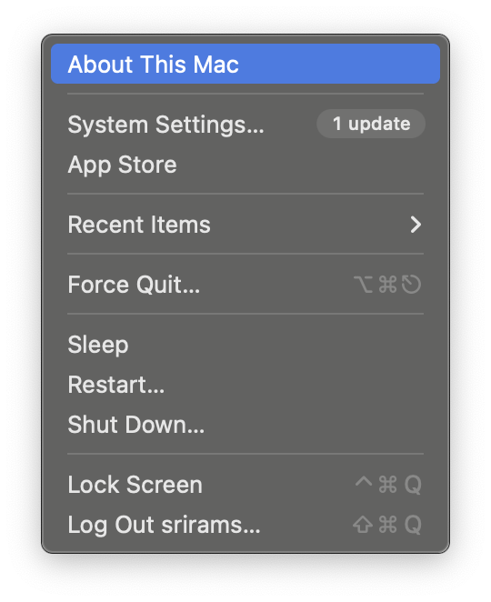
    - **Determine Chip Type**: If it says "Apple M1" or "Apple M2," you have an Apple Silicon Mac. If it says "Intel," you have an Intel Mac. <br/>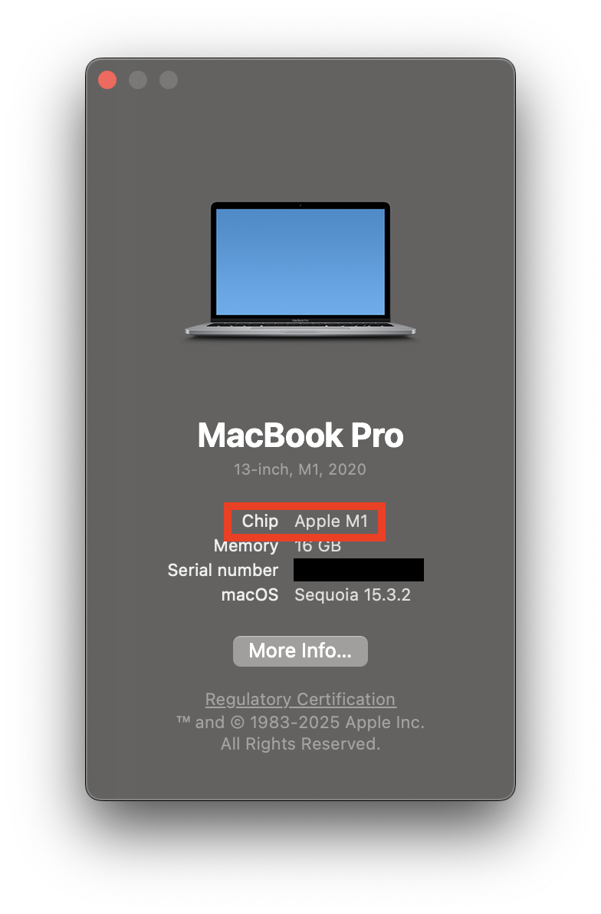

1. **Download Docker Desktop**: Go to the [Docker Desktop for Mac OS](https://docs.docker.com/desktop/setup/install/mac-install/) page and download the installer.
    - **Choose the Correct Version**: Make sure to download the version that matches your chip type (Intel or Apple Silicon).
    <br/>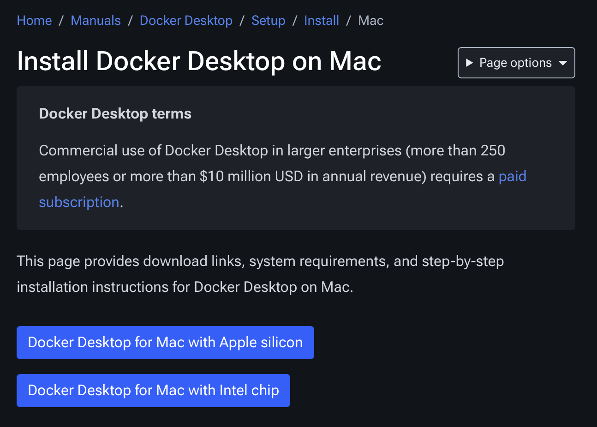

2. **Install Docker**: Docker Desktop is installed like any other application on Mac OS. 
    - **Move Docker to Applications**: After downloading, open the `docker.dmg` file and drag the Docker icon to your Applications folder. This will install Docker Desktop on your Mac. <br/>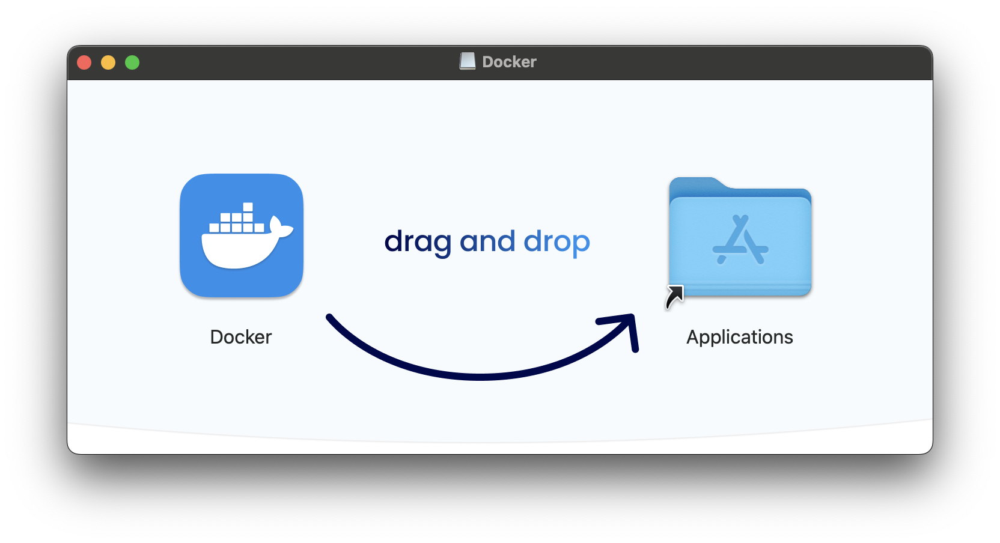

    - **Run the Installer**: Open your Applications folder and double-click on the Docker icon to start Docker Desktop. 
    <br/>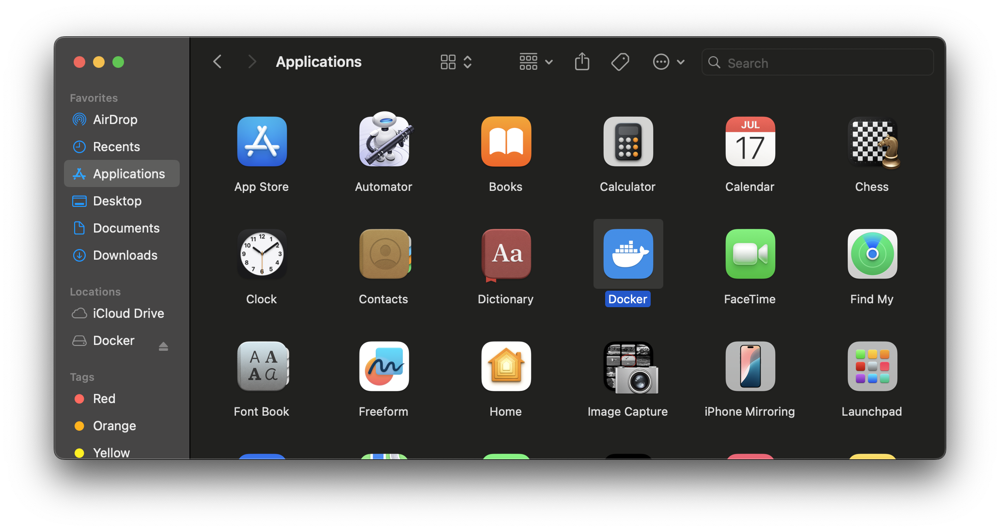

    - **Configure Settings**: Check `Use Reccommended Settings` to allow Docker to use the recommended settings for your system. 
    <br/>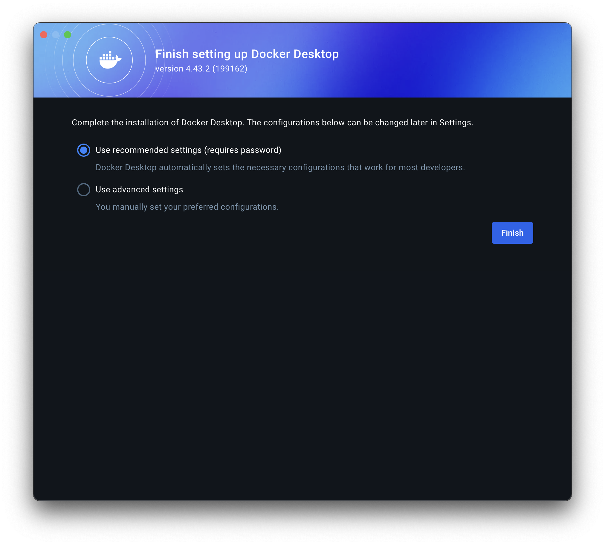

    - **Let Docker Install**: The installer will take a few minutes to set up Docker Desktop. Once completed, you may need to restart your computer.

    - **Rosetta 2**: If you are using an Apple Silicon Mac, you may be prompted to install Rosetta 2. This is necessary for running Intel-based applications on Apple Silicon Macs. Follow the prompts to install Rosetta 2 if needed. 
    <br/>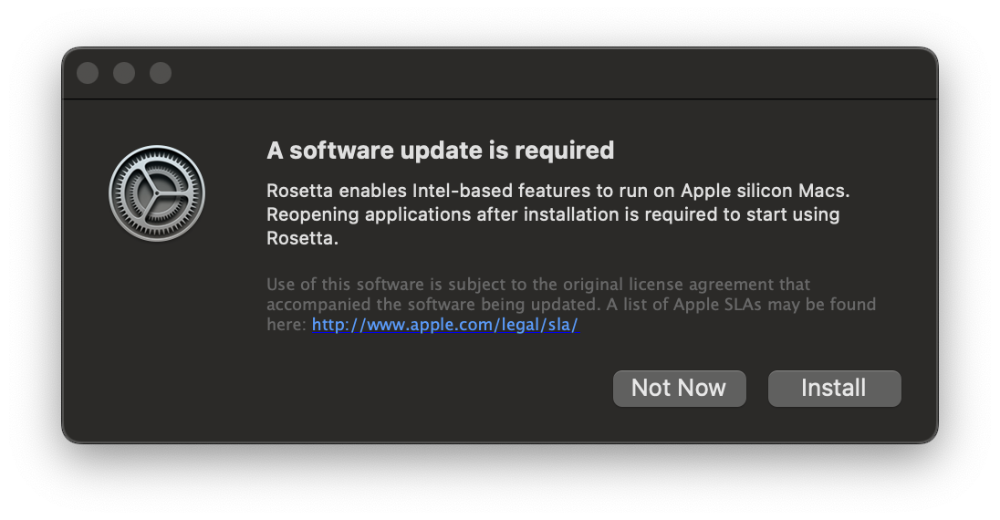

3. **Start Docker Desktop**: After installation, launch Docker Desktop from the Start menu. 
    
    - **Accept the Terms**: During first launch, you will be prompted to accept the terms of service. Make sure to read and accept them  <br/>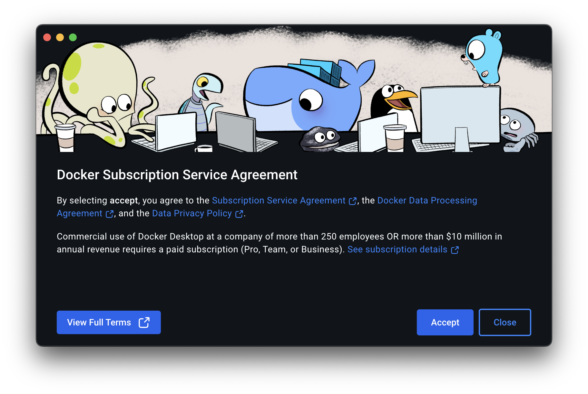

    - **Skip the Login**: You can skip the login prompt by clicking "Skip for now" if you don't want to create a Docker account at this time. <br/>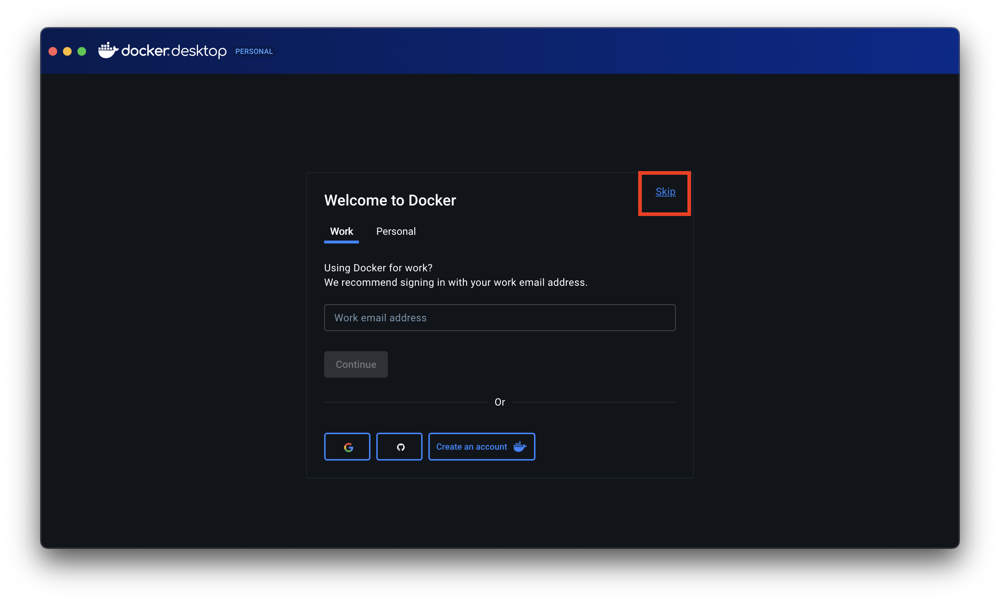

    - **Check that Docker Engine is Running**: Ensure that Docker Engine is running. You should see a green indicator in the Docker Desktop interface (bottom-left-hand corner). If it shows "Docker Engine is starting," wait for it to complete. <br/>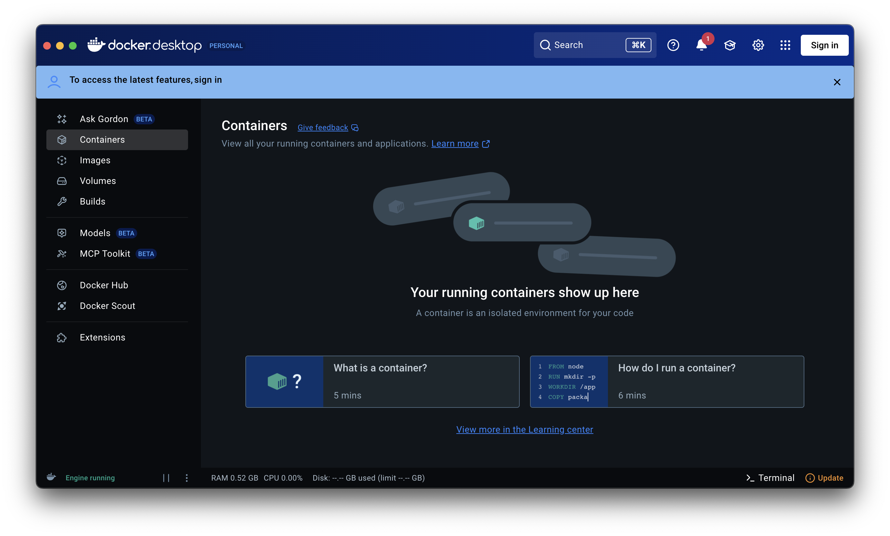
        

### Congratulations🎉! You have successfully installed Docker Desktop on your MacOS machine.

## Step 2: Installing and Running `webtop`
We host `webtop` on GitHub, and you can easily clone the repository to your local machine. Normally, you would use Git to clone the repository, but since you are new to Git, we will provide an alternative __(easier)__ method to download `webtop` directly as a ZIP file. 

1. **Downloading Webtop**: Download `webtop` by clicking on [this link](https://github.com/learn-compsci/webtop/archive/refs/heads/main.zip). It should download a `.zip` file. Unzip into a folder of your choice (but remember where it is!)

2. **Start Docker Desktop**: Start Docker Desktop if it is not already running. 

3. **Start the Webtop Container**: For MacOS users, you can start `webtop` using the terminal. This requires you to navigate to the folder where you unzipped `webtop` and run some commands. 

    - **Open Terminal at the folder**: Open the context menu by ctrl-clicking on the `webtop` folder. Select `New Terminal at Folder`. This will open a terminal window in the `webtop` folder.
    <br/>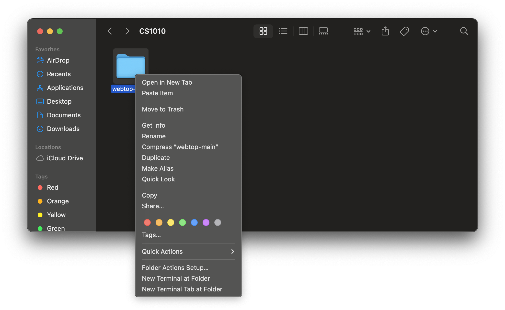
    - **Terminal Output**: Once the terminal is open, you will see a command prompt. 
    <br/>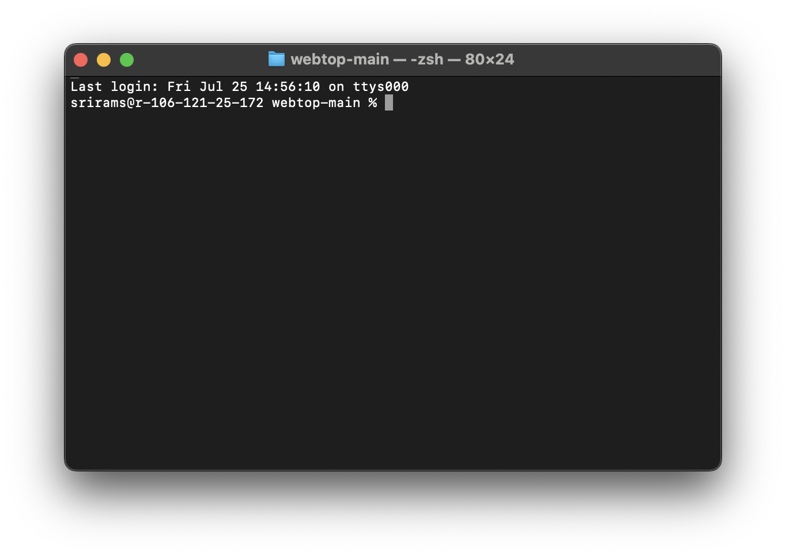


    - **Start Webtop**: In the terminal, type the following command and hit `Enter`:
    ```bash
    docker compose up
    ```
    It is important that your terminal is opened in the `webtop` folder, as this is where the Docker Compose file is located. Otherwise, the command will not work correctly.

    If you have done everything correctly, you should see output indicating that Docker is pulling the necessary images and starting the `webtop` container. This may take a few minutes, depending on your internet speed and system performance.
    <br/>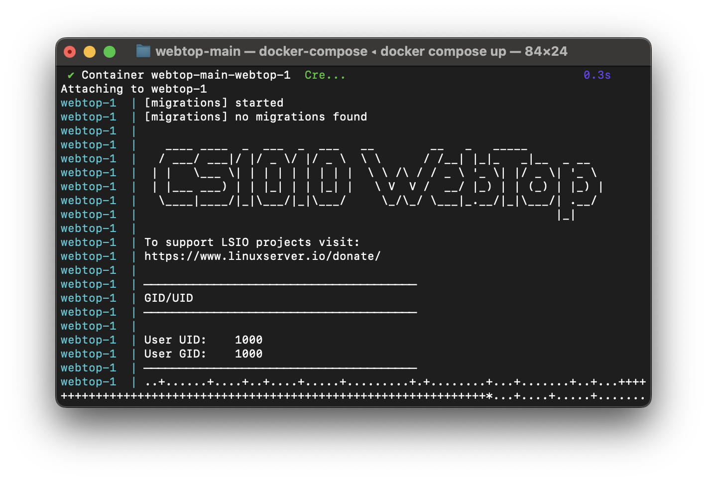

4. **Accessing Webtop**: Once the container is running, open your web browser (e.g., Chrome, Firefox, Edge) and go to `http://localhost:3000`. You should see the `webtop` desktop interface.
    </br>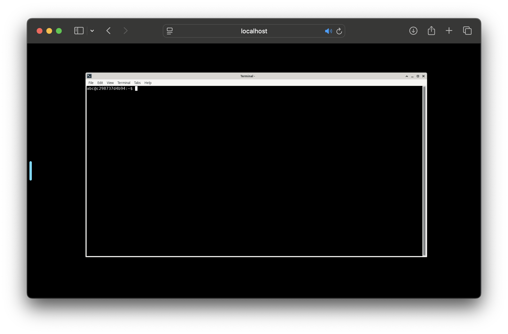

5. **Stopping Webtop**: To stop `webtop`, you can either:
    - Hit `Control-C` in the terminal where you started `webtop`. This will stop the Docker container and return you to the command prompt.
    - Close the terminal window where `webtop` is running. This will also stop the Docker container.

### Congratulations! You have successfully installed and run `webtop` on your machine. 
You can now use the Linux desktop environment in your web browser. However, before you dive in to exploring `webtop`, please read the rest of this guide to understand some [important usage notes](#critical-usage-notes) and how to [update](#updating-webtop) `webtop`. Furthermore, if you encounter any issues, we have a [troubleshooting section](#troubleshooting-common-issues) at the end of this guide.

# 🆕📦Updating Webtop🆕📦
We may occasionally release updates to `webtop`. The following steps will guide you through updating `webtop` on your Mac OS system:

1. **Running the Update Command**: Follow instructions in [Step 2](#step-2-installing-and-running-webtop) to open a terminal in the `webtop` folder. 

2. **Pulling the Latest Changes**: In the terminal, run the following command to pull the latest changes from the `webtop` repository:
    ```bash
    docker compose pull
    ```
3. **Rebuilding the Container**: After pulling the latest changes, rebuild the `webtop` container by running:
    ```bash
    docker compose build --no-cache
    ```
4. **Start Webtop Again**: After the update is complete, you can start `webtop` again as usual.

# 🚨Critical Usage Notes🚨
Before using `webtop`, please read the following important notes regarding the `webtop` environment:

- **Data Sharing** The files you create on `webtop` are mostly automatically shared/synced to the `data/` folder that should be created.

- **Data persistence**: The `webtop` environment only guarantees that files in your `webtop`'s home directory (`~/` i.e., `/config`) are retained on each reboot. All files in other locations might not be preserved on container shutdown.

- **System Wide Applications**: If you install applications system-wide, they may not be available the next time you start `webtop` (due to the above behavior). 
    - You can install applications locally (within `~/`), or use [proot-apps](https://github.com/linuxserver/proot-apps) to do this, but we try to install everything that you need from the start.


# 🛠️Troubleshooting Common Issues🛠️
- Please refer to the [Troubleshooting Common Issues](README.md#troubleshooting-common-issues) section in the main `webtop` installation guide for solutions to common issues you might encounter while using `webtop`.


