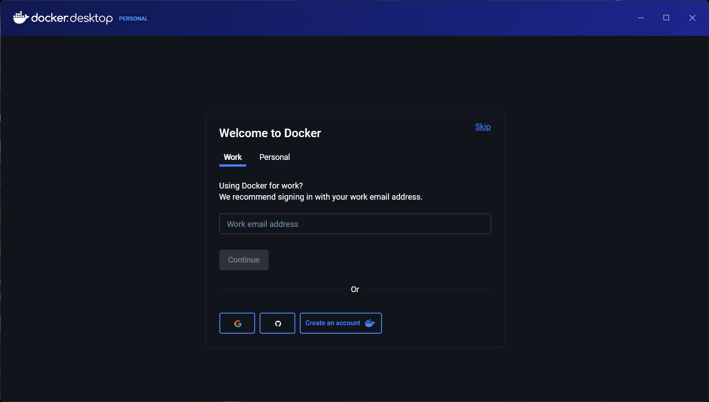
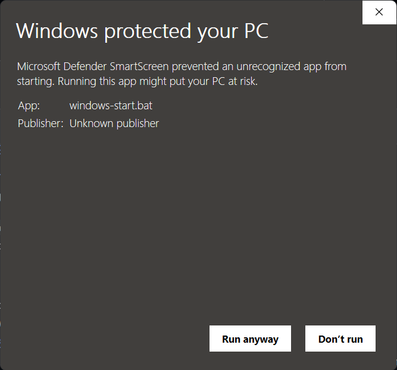

# Webtop Installation on Windows
This guide is designed to help you install and use `webtop` on Windows, even if you're new to Docker or Git. We include step-by-step instructions to ensure a smooth setup process.

## Prerequisites
- **Windows 10 or later**: Ensure your system is up to date.
- **Internet Connection**: A stable internet connection is required for downloading Docker and Git.
- **Administrator Access**: You may need administrator privileges to install software.

## Step 1: Installing Docker Desktop
Docker is essential for running `webtop`. Follow these steps to install Docker Desktop on Windows:

1. **Download Docker Desktop**: Go to the [Docker Desktop for Windows](https://docs.docker.com/desktop/setup/install/windows-install/) page and download the installer. **Preferably, install the version NOT from the Microsoft Store**.
<br/>

2. **Run the Installer**: Double-click the downloaded file to run the installer. Follow the on-screen instructions to complete the installation.
    - **Configure Settings**: Please make sure to check `use WSL2 instead of Hyper-V` <br/>

    - **Let Docker Install**: The installer will take a few minutes to set up Docker Desktop. Once completed, you may need to restart your computer.

    - **Logout or Restart to Complete Installation**: After installation, you may be prompted to log out or restart your computer. If prompted, choose to restart your computer to apply the changes.
    <br/>

3. **Start Docker Desktop**: After installation, launch Docker Desktop from the Start menu. 
    
    - **Accept the Terms**: During first launch, you will be prompted to accept the terms of service. Make sure to read and accept them  <br/>

    - **Skip the Login**: You can skip the login prompt by clicking "Skip for now" if you don't want to create a Docker account at this time. <br/>

    - **Check that Docker Engine is Running**: Ensure that Docker Engine is running. You should see a green indicator in the Docker Desktop interface (bottom-left-hand corner). If it shows "Docker Engine is starting," wait for it to complete. <br/>
        - **Outdated WSL Alert**: You might see a warning about WSL being outdated. If you do, follow the instructions to update WSL. Otherwise, Docker might not run properly.
        </br>
        
            Open PowerShell or Command Prompt as an administrator and run the following command to update WSL:
            ```bash
            wsl --update
            ```
            </br>
        - **Restart Docker Desktop**: After updating WSL, you may need to restart Docker Desktop for the changes to take effect. Hit Restart in the Docker Desktop interface or close and reopen Docker Desktop.

### Congratulations🎉! You have successfully installed Docker Desktop on your Windows machine.

**Note**: On Windows, Docker Desktop uses WSL2 (Windows Subsystem for Linux) to run containers. This __WSL Runtime__ can consume some amount of system resources, even when Docker is not actively running containers. 
    
If you want to stop Docker Desktop completely, you can right-click the Docker icon in the system tray and select "Quit Docker Desktop." This will free up system resources until you start Docker Desktop again.

You might also want to disable the automatic start of Docker Desktop on system startup to save resources. You can do this by going to Docker Desktop settings and unchecking "Start Docker Desktop when you log in."


## Step 2: Installing and Running `webtop`
We host `webtop` on GitHub, and you can easily clone the repository to your local machine. Normally, you would use Git to clone the repository, but since you are new to Git, we will provide an alternative __(easier)__ method to download `webtop` directly as a ZIP file. 

1. **Downloading Webtop**: Download `webtop` by clicking on [this link](https://github.com/learn-compsci/webtop/archive/refs/heads/main.zip). It should download a `.zip` file. Unzip into a folder of your choice (but remember where it is!)

2. **Start Docker Desktop**: Start Docker Desktop if it is not already running. You should see the Docker icon in your system tray (bottom-right corner of your screen).

3. **Start the Webtop Container**: For windows users, we provide some convenient scripts to start `webtop` without needing to use the terminal.
    - **Running the Webtop Start Script**: Locate `webtop-start.bat` in the folder where you unzipped `webtop`. Double-click on this file to run it. This script will start the `webtop` container using Docker.
    </br>

    - **Windows Security Alert (1)**: Windows might issue a security prompt for the script. To run the script, first click `more info` </br>

    - **Windows Security Alert (2)**: Then click `Run anyway` to allow the script to run. </br>

    - **Terminal Output**: Once the script is running, a terminal window will open, and you will see output indicating that Docker is starting the `webtop` container. Wait for the process to complete. It may take a few minutes, especially the first time you run it. <br/>

4. **Accessing Webtop**: Once the container is running, open your web browser (e.g., Chrome, Firefox, Edge) and go to `http://localhost:3000`. You should see the `webtop` desktop interface.
    </br>

5. **Stopping Webtop**: To stop `webtop`, you can either:
    - Hit `Control-C` in the terminal window that opened when you ran the `webtop-start.bat` script. This will stop the Docker container.
    - Close the terminal window that opened when you ran the `webtop-start.bat` script.

### Congratulations! You have successfully installed and run `webtop` on your Windows machine. 
You can now use the Linux desktop environment in your web browser. However, before you dive in to exploring `webtop`, please read the rest of this guide to understand some [important usage notes](#critical-usage-notes) and how to [update](#updating-webtop) `webtop`. Furthermore, if you encounter any issues, we have a [troubleshooting section](#troubleshooting-common-issues) at the end of this guide.

# 🆕📦Updating Webtop🆕📦
We may occasionally release updates to `webtop`. To update your installation, we have provided a script that will pull the latest changes from the repository and rebuild the Docker container.

1. **Running the Update Script**: Locate `webtop-update.bat` in the folder where you unzipped `webtop`. Double-click on this file to run it. This script will pull the latest changes and rebuild the Docker container.
    </br>

2. **Windows Security Alerts**: If you see a Windows security prompt, follow the same steps as [Step 2](#step-2-installing-and-running-webtop) to allow the script to run.
    </br>

3. **Start Webtop Again**: After the update is complete, you can start `webtop` again by running the `webtop-start.bat` script as described in [Step 2](#step-2-installing-and-running-webtop).


# 🚨Critical Usage Notes🚨
Before using `webtop`, please read the following important notes regarding the `webtop` environment:

- **Data Sharing** The files you create on `webtop` are mostly automatically shared/synced to the `data/` folder that should be created.

- **Data persistence**: The `webtop` environment only guarantees that files in your `webtop`'s home directory (`~/` i.e., `/config`) are retained on each reboot. All files in other locations might not be preserved on container shutdown.

- **System Wide Applications**: If you install applications system-wide, they may not be available the next time you start `webtop` (due to the above behavior). 
    - You can install applications locally (within `~/`), or use [proot-apps](https://github.com/linuxserver/proot-apps) to do this, but we try to install everything that you need from the start.


# 🛠️Troubleshooting Common Issues🛠️
- Please refer to the [Troubleshooting Common Issues](README.md#troubleshooting-common-issues) section in the main `webtop` installation guide for solutions to common issues you might encounter while using `webtop`.


